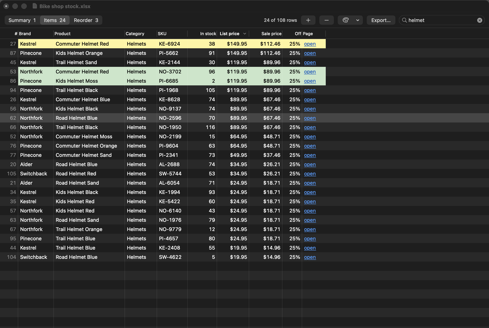

# Sheet Viewer

A small, fast Mac app for looking at spreadsheets. It opens CSV, Excel and Numbers
files in one window with a tab per page, sorts on a click, filters as you type, and
handles the simple edits: fix a cell, add or delete rows and pages, color a row,
export.

It is not a spreadsheet program. There are no formulas and no charts, which is why
it opens at once.



## What it does

- **Opens** `.csv`, `.tsv`, `.xlsx`, `.xlsm`, `.xls`, `.xlsb`, `.ods` and `.numbers`.
- **One window per file, one tab per page.** While you search, each tab shows how
  many of its rows match.
- **Sort** by clicking a column header. Money, percents, thousands and dates sort by
  value, not by spelling, and blank cells always sink to the bottom. Click `#` to go
  back to the file's own order.
- **Search** by typing. A row stays if it contains every word you typed, in any
  column.
- **Links open on a click**, including a plain web address typed into a cell. A
  link to anything other than a web page or an email address is shown in full and
  asked about first, since a file someone sent you can hide any target behind any
  word.
- **Shows the file's styling**: cell fills, text colors, bold and italic.
- **Light editing**, all of it undoable:
  - double-click a cell to change it (Tab moves to the next cell)
  - add a row under the selected one, or delete the selected rows
  - add or delete a page (right-click the tabs)
  - color rows or single cells from the palette button or a right-click
- **Export** the current page as CSV, or every page as an Excel workbook, in the
  order on screen. With a search active you can export only the rows showing.
- **Fast on big files.** A 300,000-row, 25 MB CSV opens in about a second and a
  half on an Apple M5.

## What it leaves out

- **Formulas.** A formula cell shows the value Excel last saved for it, or the
  formula itself when the file holds no value (a workbook a script wrote and no
  spreadsheet app has opened). An Excel export writes values, colors and links,
  never formulas, and is offered under a new name so the original stays as it was.
- **Hidden precision.** An export writes each number as it is shown. A cell
  holding 0.3333 and shown as 33% is exported as 0.33.
- **Layout.** No charts, images, merged cells, column widths or font sizes.
- **Colors in a CSV.** A CSV is plain text and has nowhere to keep them. Export as
  Excel to keep the colors you add.
- **Saving back as Numbers or OpenDocument.** Those open, and export as CSV or
  Excel.

## Install

You need a Mac with the Xcode Command Line Tools (`xcode-select --install`) and
[uv](https://docs.astral.sh/uv/) (`brew install uv`).

```sh
git clone https://github.com/chris-jk/sheet-viewer.git
cd sheet-viewer
./build.sh
```

That builds `~/Applications/Sheet Viewer.app`. To also make it the app that opens
spreadsheets when you double-click them:

```sh
./build.sh --default
```

It was built and is used on macOS 26 on Apple silicon. Nothing in it should need
anything newer than macOS 13, but that has not been tried.

## How it is put together

| File | What it is |
|---|---|
| `main.swift` | The whole app: one AppKit file. Reads and writes CSV itself. |
| `read.py` | Reads Excel and Numbers files (openpyxl, python-calamine, numbers-parser). |
| `write.py` | Writes the Excel export (openpyxl). |
| `make_icon.swift` | Draws the app icon at build time. |
| `build.sh` | Compiles, bundles, signs and installs. |

The two Python scripts run in their own environment, which `build.sh` creates at
`~/Library/Application Support/Sheet Viewer/venv`. CSV files never touch Python.

## Checking it without clicking

The app can test itself and draw its own window to a picture, so a change can be
checked without touching the screen:

```sh
app=~/Applications/"Sheet Viewer.app"/Contents/MacOS/SheetViewer

# the reading, sorting, search and editing rules
"$app" --selftest

# open a file off screen, run some actions, save a picture of the window
"$app" --snapshot stock.xlsx window.png --do "sheet:1;search:helmet;sortdesc:5;select:0;color:FFF59D"
```

`build.sh` runs the self-test on every build. The commands `--do` accepts are listed
above `run(script:)` in `main.swift`.

## Removing it

Move `~/Applications/Sheet Viewer.app` and
`~/Library/Application Support/Sheet Viewer` to the Trash.

## License

MIT. See [LICENSE](LICENSE).
